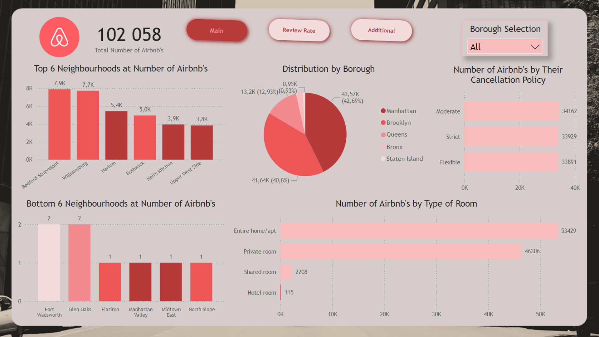

# Portfolio Projects

## Following bellow are my projects in SQL, Python, Power Bi & Excel:  

#### *You can also take a look at my Linkedin : [RafałGabin](https://www.linkedin.com/in/rafał-gabin-4a144a250/)*  

- [x] **SQL & Power Bi** -

  - Netflix Data Analysis Project 
  
  - Data Cleaning and Data Exploration  
  
*Review the SQL Script:* **[HERE](https://github.com/Rafalgabin/PortfolioProjects/blob/main/Netflix)** 

  - Airbnb Open Data Dataset Analysis Project  
  
  - Data Cleaning and Data Exploration  
  
*Review the SQL Script:* **[HERE](https://github.com/Rafalgabin/PortfolioProjects/blob/main/Airbnb_Open_DataProject)** 

  - Supermarket Sales Dataset Analysis Project  
  
  - Data Cleaning and Data Exploration  
  
*Review the SQL Script* **[HERE](https://github.com/Rafalgabin/PortfolioProjects/blob/main/Supermarket_Sales)** 

- [x] **Python, SQL & Power Bi** -

  - HR Employee Attrition Dataset Analysis Project  
  
  - Data Cleaning and Data Exploration  
  
*Review the SQL Script* **[HERE](https://github.com/Rafalgabin/PortfolioProjects/blob/main/HR%20Employee%20Attrition)** 

*Review the Python Script* **[HERE](https://github.com/Rafalgabin/PortfolioProjects/blob/main/HR%20Employee%20Attrition%20Python.ipynb)** 

- [x] **Excel** -
      
*Kindly download these Excel files from this repository and view them in Microsoft Excel.*

- Global AI Job Market 2024-2025 Dashboard  

--------------------------------------------------------------------------------------------------------------------------------------------------------------------------------
